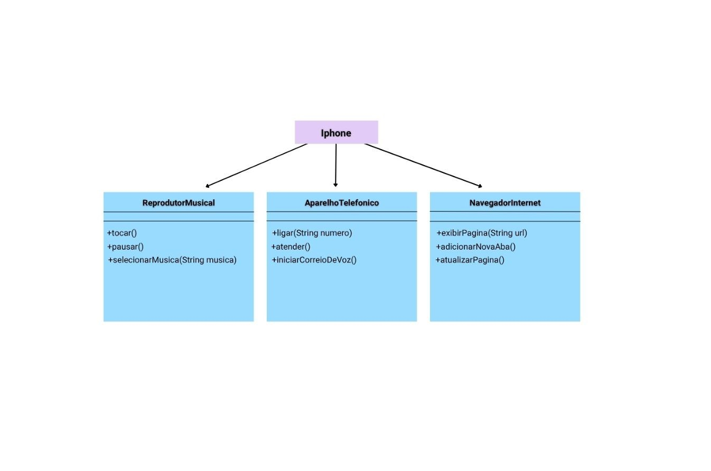

# 📱 Simulador de iPhone - POO com Java

Projeto desenvolvido como parte do **Bootcamp Santander Backend Java 2025**, com o objetivo de aplicar os princípios de **Programação Orientada a Objetos (POO)** e o uso de **interfaces em Java**.

Inspirado no lançamento do primeiro iPhone em 2007, este projeto simula suas três principais funcionalidades:

- 🎵 Reprodutor Musical
- ☎️ Aparelho Telefônico
- 🌐 Navegador na Internet

---

## 🚀 Tecnologias Utilizadas

- Java 17+
- Terminal (CLI)
- Paradigmas de Programação Orientada a Objetos (POO)

---

## 🎯 Objetivo do Projeto

Modelar e implementar um componente iPhone utilizando interfaces, encapsulamento e separação de responsabilidades. O projeto reforça o uso de:

- Interfaces com múltiplos métodos
- Implementação concreta com lógica
- Organização em pacotes
- Interação com usuário via terminal (`Scanner`)

---

## 🧩 Funcionalidades

### 🎵 Reprodutor Musical
- `tocar()`
- `pausar()`
- `selecionarMusica(String musica)`
- `verPlaylist(List<String> playlist)`

### ☎️ Aparelho Telefônico
- `ligar(String numero)`
- `atender()`
- `iniciarCorreioDeVoz()`

### 🌐 Navegador na Internet
- `exibirPagina(String url)`
- `adicionarNovaAba()`
- `atualizarPagina()`

---

## Diagrama UML iphone


## 📁 Estrutura de Pacotes

```text
src/
└── iphone/
    ├── Main.java                  // Ponto de entrada
    ├── Menu.java                  // Menu interativo
    ├── interfaces/                // Interfaces com funcionalidades
    │   ├── AparelhoTelefonico.java
    │   ├── NavegadorInternet.java
    │   └── ReprodutorMusical.java
    └── modelo/
        └── Iphone.java            // Classe que implementa todas as interfaces


```
## 💻 Como Executar
```bash
Clone o repositório:
git clone https://github.com/seu-usuario/iphone-poo-java.git
```

## Compile e execute:
```cd iphone-poo-java/src
javac iphone/Main.java
java iphone.Main
java iphone.Main 
```


📌 Observações
Projeto feito com foco educacional, para reforçar conceitos de interfaces, orientação a objetos e organização de código.

Ideal para quem está começando no backend com Java.

👨‍💻 Autor
Dhonata Chaves Santos
Estudante de Engenharia de Software | Participante do Bootcamp Santander Backend Java 2025

Conecte-se comigo no [LinkedIn](https://www.linkedin.com/in/dhonata)


